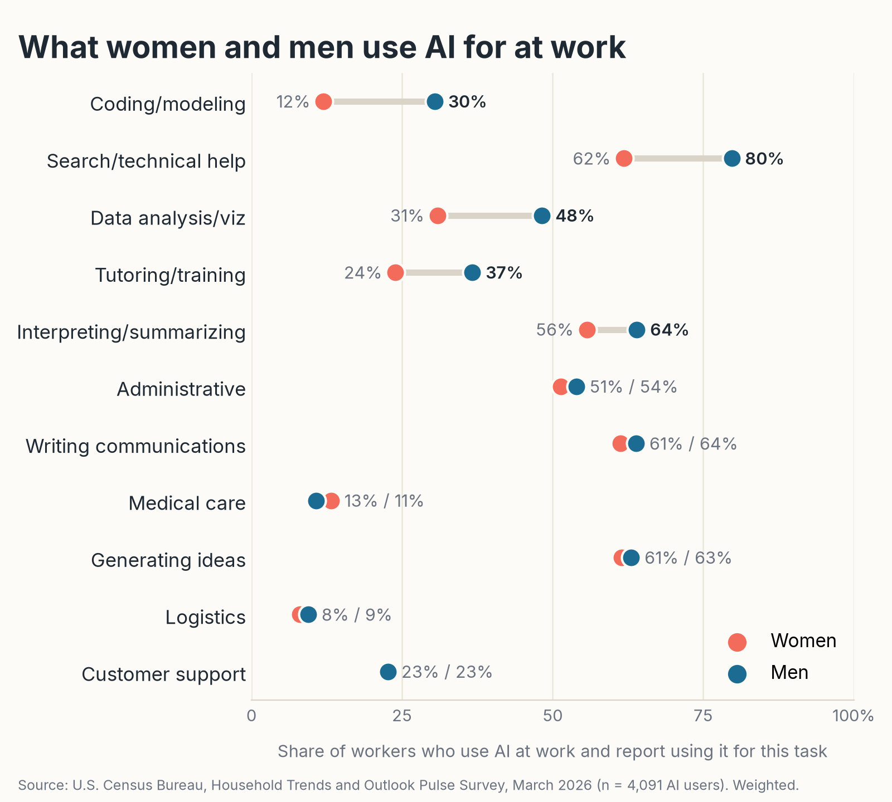

# AI at work: the gender gap is in depth of use, not adoption

Analysis of the U.S. Census Bureau's **March 2026 Household Trends and Outlook Pulse Survey (HTOPS)**, the first public person-level dataset with an explicit "AI at work" module. 6,680 employed adults, eleven task types, frequency of use, and self-reported hours saved.

The headline: women and men have used AI at work at the same rate (51% vs 53%), but men are nearly twice as likely to use it every day (9% vs 16%), use it for more task types (3.9 vs 4.7), and report more hours saved. The daily-use gap does not move under twenty controls, is not explained by occupation or parenthood, and is largest in computer occupations.



## What is here

| Folder | Contents |
|---|---|
| `reports/` | **AI_at_Work_HTOPS_March2026_Report.docx**, the full report on every AI-at-work finding in the file (adoption, tasks, who uses it, time saved, telework, wellbeing, trust, benchmarks). **AI_at_Work_Gender_Gap_Addendum.docx**, the gender deep dive: specification ladder, Oaxaca-Blinder decomposition, subgroup heterogeneity, task mix, and a weighted-versus-unweighted comparison. |
| `charts/` | All figures from both reports plus the LinkedIn share image. |
| `data/derived/` | Every estimate in the reports as JSON (`results.json`, `gender.json`) and the table rows built from them. |
| `scripts/` | The full pipeline, numbered in run order. `run_all.sh` reproduces everything from the raw Census file. |

Raw microdata are not in the repo. `scripts/00_download_data.py` fetches them from census.gov (about 50 MB).

## Key findings

**Adoption is wide but shallow.** 52% of workers have used AI for at least one work task, 36% used it in the survey week, 12% used it every day. Use is concentrated in search, writing, summarizing and ideation; logistics and medical care stay under 7%.

**Occupation, education and telework dominate, but telework absorbs much of the rest.** Among workers who teleworked at least one day, adoption is 63–93% in every major occupation group and 66–86% at every education level, including workers without a high-school diploma.

**The gender gap is in intensity.** The 7-point daily-use gap survives controls for age, race, region, metro, education, income, occupation, sector, telework days, marital status, children by age, household size, insurance, disability, home language, PHQ-4 and life satisfaction. Among users, women and men report the writing tasks at the same rates; the male surplus is in technical search (+18 pts), coding (+18), data analysis (+17) and self-training (+13).

**Counterintuitive results.** Adoption is flat from age 25 to 64 rather than highest among the young. The occupations that use AI most are the most likely to say it cost them time. The South leads and the Midwest lags after controls. AI use is uncorrelated with anxiety, depression or loneliness once occupation and demographics are held fixed.

## Method notes

Weighted estimates use the person weight `PWEIGHT` with standard errors from the Bureau's 80 successive-difference replicate weights, Var = (4/80) Σ(θᵣ − θ)². Regressions are weighted linear probability models re-estimated with each replicate weight. Unweighted estimates (OLS, HC1 robust SEs) are shown beside every weighted one because the Bureau has announced that the March and May 2026 weights used incorrect population controls and will be corrected; nothing substantive in either report depends on which is used. The Kitagawa-Oaxaca-Blinder decomposition uses pooled coefficients.

Two things to know before quoting a number. The HTOPS weights are extremely dispersed (the top 10% of respondents carry 60% of the weight; Kish design effect about 8), so weighted subgroup estimates for young, less-educated or blue-collar workers rest on few respondents. And everything here is an association in a single cross-section; AI use is self-selected and the survey cannot support causal claims.

Full definitions, universes and coding are in Appendix B of each report.

## How this was made

I did this analysis in Claude Cowork over a weekend. I told Claude what I wanted (a rigorous, economist-style read of the AI module, careful about causal language, with the counterintuitive findings pulled out), answered its scoping questions, and it downloaded the public-use file, wrote the Python and node scripts in this repo, ran them, and drafted both reports. Before each report was finalized, a second, independent pass recomputed every headline number from the raw CSV and checked it against the text; the two verification scripts are in `scripts/`. The gender deep dive and the weighted-versus-unweighted comparison came from follow-up questions I asked once I had read the first report. The chart styling is mine; the statistics are standard survey methods applied to a standard Census file, and anyone can re-run `scripts/run_all.sh` and get the same numbers.

## Reproducing

```bash
pip install -r requirements.txt
npm install docx            # for the Word reports only
bash scripts/run_all.sh
```

Python 3.10+ and node 18+. The Word reports use the `docx` npm package; skip steps 06 and 07 if you only want the numbers and charts.

## Sources

- U.S. Census Bureau, [HTOPS public use files](https://www.census.gov/programs-surveys/household-pulse-survey/data/datasets.html) and the March 2026 [PUF zip](https://www2.census.gov/programs-surveys/demo/datasets/hhp/2026/topical/HTOPS_HPS_2603_CSV.zip)
- U.S. Census Bureau, [HTOPS Source and Accuracy Statement, June 2025](https://www2.census.gov/programs-surveys/demo/technical-documentation/hhp/HTOPS_2506_Source_and_Accuracy.pdf)
- Federal Reserve, [Monitoring AI Adoption in the U.S. Economy](https://www.federalreserve.gov/econres/notes/feds-notes/monitoring-ai-adoption-in-the-u-s-economy-20260403.html), FEDS Notes, April 2026
- Bick, Blandin and Deming, [The Rapid Adoption of Generative AI](https://papers.ssrn.com/sol3/papers.cfm?abstract_id=4964384) and the [FRED Blog](https://fredblog.stlouisfed.org/2026/08/does-generative-ai-save-time-at-work/) update, August 2026
- Pew Research Center, [Key findings about how Americans view AI](https://www.pewresearch.org/short-reads/2026/03/12/key-findings-about-how-americans-view-artificial-intelligence/), March 2026

## License

Code: MIT (`LICENSE`). Reports and charts: CC BY 4.0 (`LICENSE-CONTENT.md`). Census microdata: public domain.
